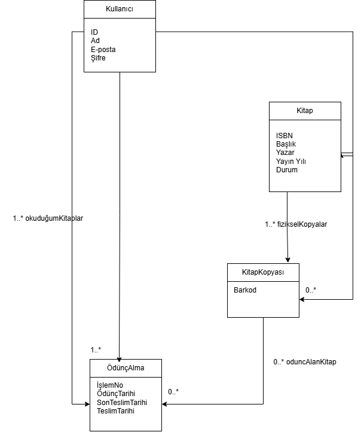

# Ödünç Kitap Yönetim Sistemi (OKYS)

Bu depo, Ödünç Kitap Yönetim Sistemi projesine ait dokümanları ve Java kodlarını içermektedir.

## İçerik
- **doc/**: Sistem gereksinimleri ve tasarım diyagramları yer alır.
- **src/**: Projeye ait Java kaynak kodları (`Kitap`, `KitapKopyasi`, `OduncKaydi`, `Kullanici`) bulunmaktadır[cite: 1].
## Proje Diyagramı
<<<<<<< HEAD

=======

>>>>>>> 571129078f461780cdbc46b7a742cb57e0fb4e2f
